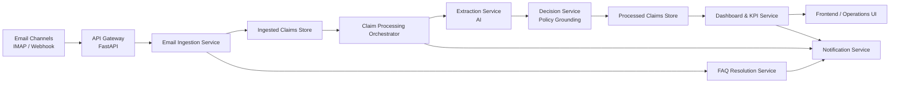

# Autonomous Claims Orchestrator - Executive Workflow Overview

## Purpose
This document presents a stakeholder-friendly overview of the end-to-end claims workflow, architecture, and business value. It is intentionally high level and avoids low-level implementation details.

## What This Platform Does
- Ingests incoming claim-related emails and attachments.
- Separates FAQ/customer-data inquiries from true FNOL claim intake.
- Runs AI-assisted extraction and policy-grounded decision support.
- Persists processed claims for operations review and KPI tracking.
- Sends customer communications (acknowledgements, under-review notices, desk rejections).

## System Footprint
- **8 backend microservices**: `claim_notification`, `dashboard`, `decision`, `email_ingestion`, `extraction`, `faq_resolution`, `ingested_claims`, `process_claim`
- **2 foundational runtime modules**: `fastapi_server` (API gateway), `common/config` (shared configuration)
- **Core data zones**:
  - Ingested zone: raw ingested claims + attachments
  - Processed zone: decision-ready claims + KPI history
  - Knowledge zone: FAQ corpus + policy/customer reference data

## Executive Architecture Diagram

## Business Workflow (High Level)
1. **Intake**: Emails are synchronized and parsed.
2. **Triage**: Non-claim/support correspondence is filtered; FAQ-type questions are auto-resolved.
3. **Claim Registration**: Valid FNOL submissions are persisted in an ingested claims store with attachment linkage.
4. **Automated Processing**: Orchestrator triggers extraction and decision support services.
5. **Decision Support**: Policy grounding validates eligibility/coverage and generates structured decision packs.
6. **Operations Visibility**: Processed claims are indexed for dashboards, reporting, and review.
7. **Customer Communication**: Notifications are sent at key lifecycle points.

## Governance and Controls
- Thread-aware deduplication limits duplicate claim records.
- Policy expiry/invalid checks can auto-route to desk rejection.
- Structured storage supports auditability and KPI transparency.
- Modular microservices reduce coupling and improve maintainability.

## Stakeholder KPIs
- Claims ingested vs processed
- Automated FAQ deflection rate
- Average processing time
- Decision confidence/grounding quality indicators
- Customer communication timeliness

## Recommended Next Steps
- Align KPI thresholds with operations SLA targets.
- Define exception handling playbooks for low-confidence decisions.
- Schedule periodic review of FAQ corpus and policy grounding data quality.
